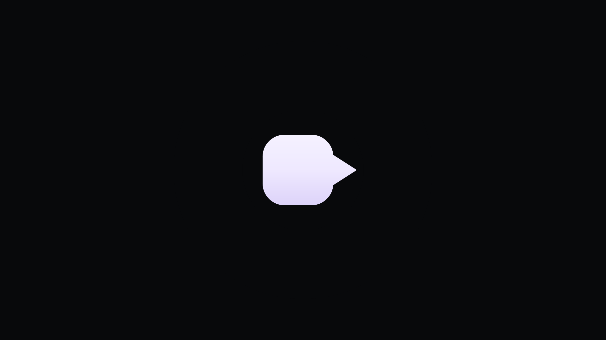
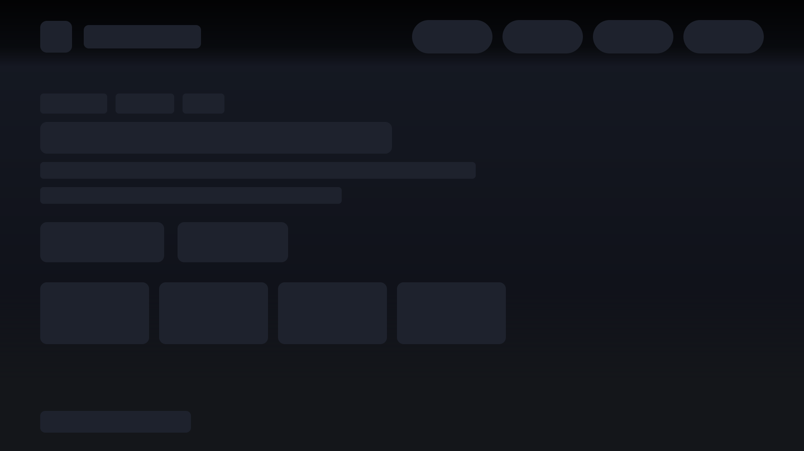
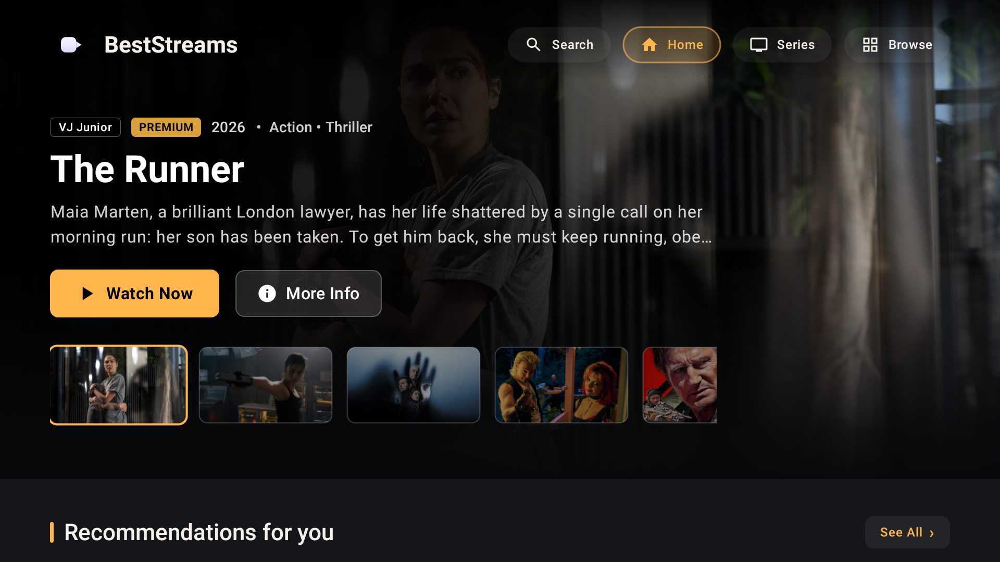
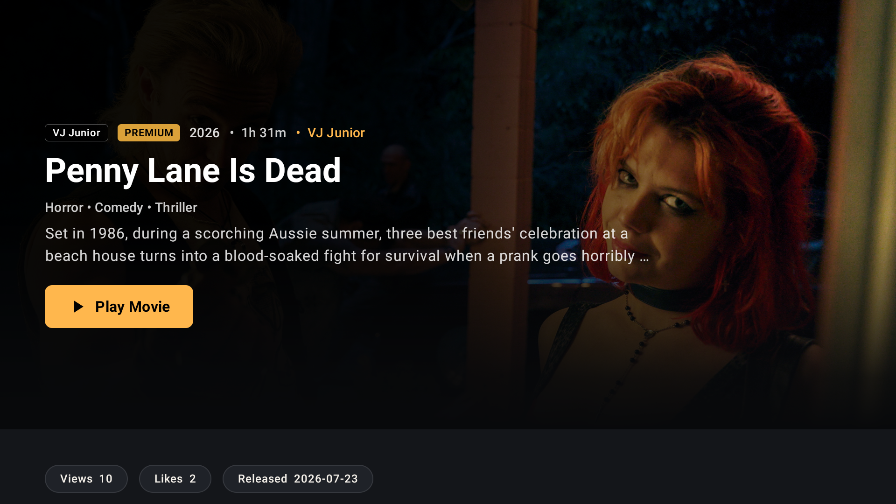
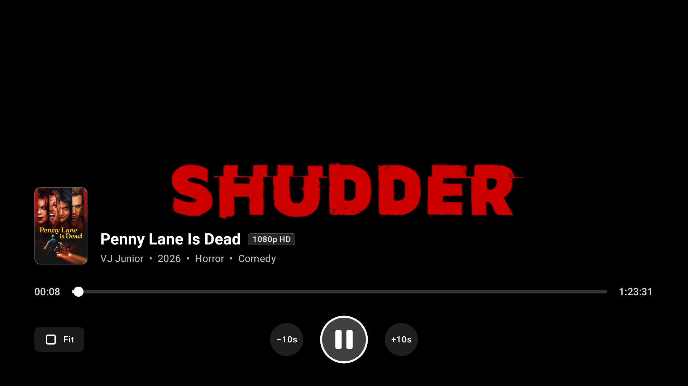
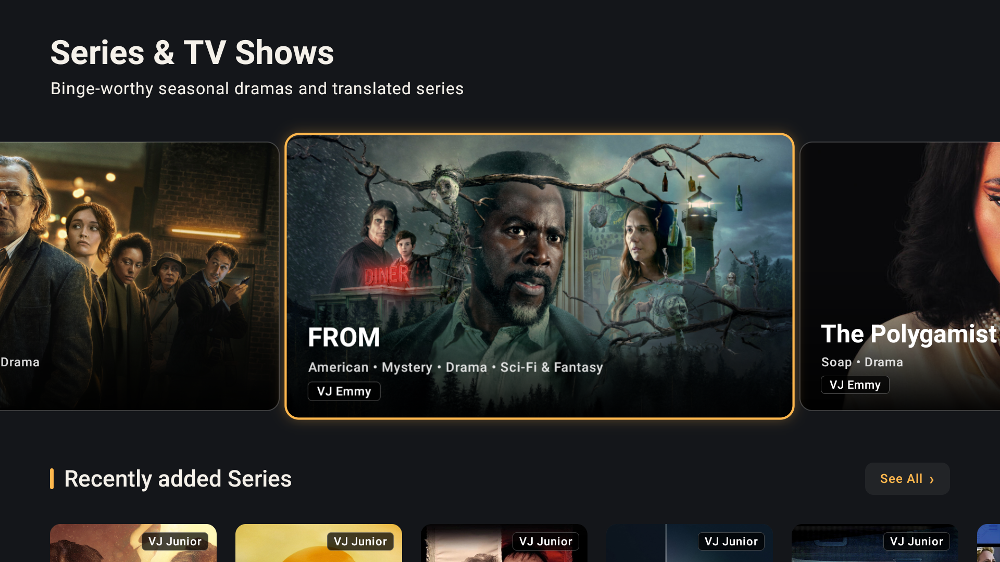
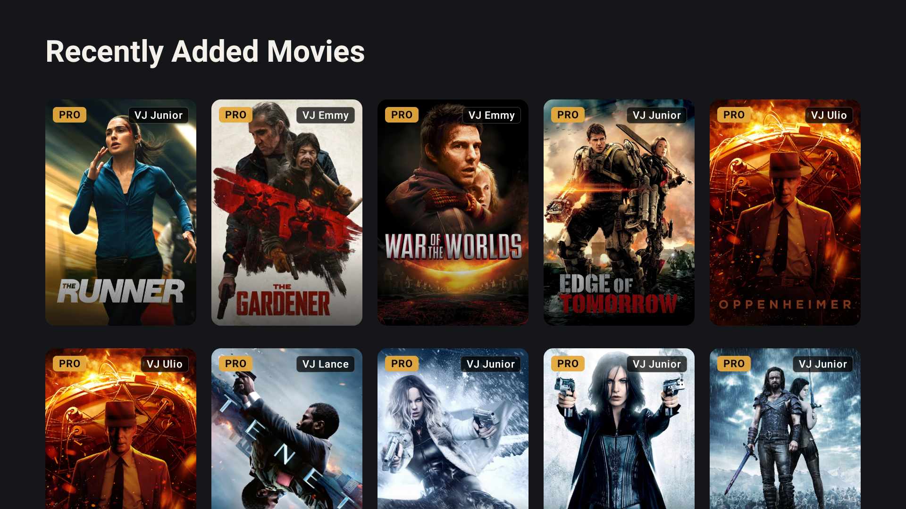
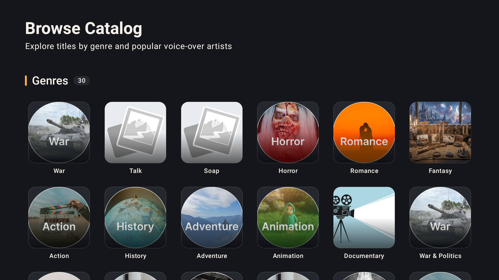
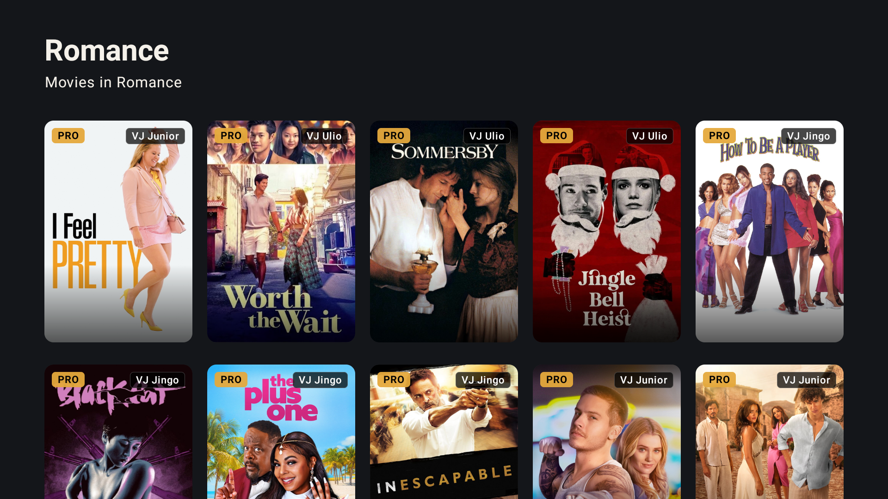

# BestStreams UG 🎬📺

<div align="center">

**A Premier, Cinematic Android TV Streaming Experience**  
*Built natively with Jetpack Compose for TV (Material 3), Media3 ExoPlayer, and Clean Architecture.*

[](https://kotlinlang.org)
[](https://developer.android.com/tv)
[](https://developer.android.com/jetpack/androidx/releases/tv)
[](https://developer.android.com/media/media3)
[](https://dagger.dev/hilt/)

</div>

---

## 🌟 Overview

**BestStreams UG** is a native Android TV streaming application crafted from the ground up for a 10-foot television experience. It delivers a rich catalog of international and locally dubbed/translated movies and television series (featuring Uganda's top Video Jockeys such as *VJ Junior*, *VJ Emmy*, *VJ Jingo*, *VJ Lance*, and *VJ Olio*).

Engineered with cutting-edge Android development standards, BestStreams UG features smooth D-Pad remote navigation, cinematic hero backdrops, smart seekable playback controls, and a robust clean architecture.

---

## 📸 Screenshots & Showcase

<div align="center">

### 🏠 Home & Discovery Experience
| Splash Screen | Shimmer Loading | Cinematic Home Hub |
| :---: | :---: | :---: |
|  |  |  |
| *Smooth branding splash* | *Content loading skeletons* | *Dynamic hero stage & top bar* |

<br/>

### 🎬 Content Details & Custom TV Player
| Content Overview & VJ Badges | Media3 ExoPlayer with Custom OSD |
| :---: | :---: |
|  |  |
| *HD playback details, metadata & voice-over badges* | *Frosted glass circular controls & 10s D-pad seek* |

<br/>

### 📺 Series Hub & Browse Catalogs
| Series & TV Shows | Recently Added Catalog Grid |
| :---: | :---: |
|  |  |
| *Binge-worthy seasonal series carousel* | *Responsive poster grid with PRO indicators* |

<br/>

### 🗂️ Categories & Genre Collections
| Browse by Genre & VJ Channels | Curated Genre Grid (Romance) |
| :---: | :---: |
|  |  |
| *30+ genre hubs & translation artists* | *Infinite-scrolling movie catalogs* |

</div>

---

## ✨ Key Features

- **🎮 10-Foot D-Pad Focus Engine:**
  - Seamless navigation tailored for physical Android TV and Google TV remote controls.
  - Directional focus requesters (`focusProperties { down = ...; up = ... }`) guaranteeing predictable cursor transitions between the top navigation bar, hero stage, and scrolling rails.
  - Zero-flicker key event pipeline distinguishing between overlay reveal and playback toggles.

- **🎥 Cinematic Hero Stage:**
  - Live backdrop fan-art crossfades synchronized with carousel selection strips.
  - Quick action buttons ("Watch Now", "More Info") with glowing focus borders.
  - Top navigation bar featuring dynamic alpha transitions (transparent at hero top, darkening upon vertical scroll).

- **⚡ Custom Android TV Media Player (Media3 / ExoPlayer):**
  - High-definition video streaming with auto-hiding OSD overlay.
  - Circular frosted glass playback controls (`−10s`, `Play/Pause`, `+10s`).
  - Interactive D-Pad scrubber / progress bar for fast-forwarding and rewinding.
  - Aspect ratio switcher cycling dynamically through **Fit**, **Fill**, and **Stretch** modes.
  - Automatic error recovery and stream reconnection fallback.

- **🏷️ VJ Translation & Voice-Over Channels:**
  - Dedicated filtering and metadata tags highlighting popular voice-over artists (*VJ Junior*, *VJ Emmy*, *VJ Jingo*, *VJ Lance*, *VJ Olio*).

- **🔍 Browse & Multi-Criteria Search:**
  - Over 30+ categorized genres (Action, Sci-Fi, Romance, Horror, War, Animation, etc.).
  - Instant search across movies, series, and cast.

---

## 🏛 Architecture & Tech Stack

The application follows **Clean Architecture** principles and the official **Android Recommended App Architecture** (MVI/MVVM pattern with unidirectional data flow).

```
┌─────────────────────────────────────────────────────────┐
│                    Presentation Layer                   │
│  Compose for TV (Material 3) • ViewModels • UI States   │
└────────────────────────────┬────────────────────────────┘
                             │
                             ▼
┌─────────────────────────────────────────────────────────┐
│                       Domain Layer                      │
│     Use Cases • Domain Models • Repository Interfaces   │
└────────────────────────────┬────────────────────────────┘
                             │
                             ▼
┌─────────────────────────────────────────────────────────┐
│                        Data Layer                       │
│    Retrofit DTOs • Repository Impls • Network Mappers   │
└─────────────────────────────────────────────────────────┘
```

### 🛠️ Libraries & Technologies

- **UI & Foundation:** [Jetpack Compose for TV](https://developer.android.com/jetpack/androidx/releases/tv) (`androidx.tv.material3`, `androidx.tv.foundation`), Compose Material Icons Extended
- **Dependency Injection:** [Dagger Hilt](https://dagger.dev/hilt/)
- **Media Engine:** [AndroidX Media3 ExoPlayer](https://developer.android.com/media/media3) (`media3-exoplayer`, `media3-ui`, `media3-common`)
- **Networking:** [Retrofit 2](https://square.github.io/retrofit/), [OkHttp 3](https://square.github.io/okhttp/) with Logging Interceptors & Gson Converter
- **Image Loading:** [Coil Compose](https://coil-kt.github.io/coil/compose/)
- **Asynchronous Flow:** Kotlin Coroutines & `StateFlow` / `SharedFlow` with `collectAsStateWithLifecycle`
- **Navigation:** Navigation Compose & Hilt Navigation Compose

---

## 📂 Project Structure

```
com.engineerfred.beststreamsug/
├── core/
│   └── common/             # AppResult, AppError, Pagination models
├── data/
│   ├── remote/api/         # Retrofit API service interfaces
│   ├── remote/dto/         # API Data Transfer Objects & Serializers
│   └── repository/         # Concrete repository implementations
├── domain/
│   ├── model/              # Domain entities (Movie, Series, Banner, Category, etc.)
│   ├── repository/         # Domain repository abstractions
│   └── usecase/            # Granular business use cases
├── presentation/
│   ├── browse/             # Browse catalog & genre directory screens
│   ├── common/             # Reusable PosterCards, RailHeaders & Skeletons
│   ├── details/            # Movie & series detail screens
│   ├── home/               # Cinematic home screen & hero carousel
│   ├── navigation/         # AppNavHost, routes, and transitions
│   ├── player/             # Media3 ExoPlayer TV player & custom OSD
│   ├── search/             # Live search screen
│   └── series/             # Dedicated series catalog & seasons screen
└── ui/theme/               # Material 3 TV typography, colors & palettes
```

---

## 🚀 Getting Started

### Prerequisites
- **Android Studio:** Ladybug (2024.2.1+) or newer
- **JDK:** Version 17
- **Target Platform:** Android TV / Google TV device or Android TV Emulator (API 24+)

### Build & Run
1. Clone the repository:
   ```bash
   git clone https://github.com/EngFred/Best-Streams-UG.git
   cd Best-Streams-UG
   ```
2. Open the project in **Android Studio**.
3. Select an **Android TV (1080p or 4K)** emulator or connect an Android TV device with ADB enabled.
4. Run the `app` configuration:
   ```bash
   ./gradlew installDebug
   ```

---

## 📄 License

```
Copyright 2026 Fred (Engineer Fred)

Licensed under the Apache License, Version 2.0 (the "License");
you may not use this file except in compliance with the License.
You may obtain a copy of the License at

    http://www.apache.org/licenses/LICENSE-2.0

Unless required by applicable law or agreed to in writing, software
distributed under the License is distributed on an "AS IS" BASIS,
WITHOUT WARRANTIES OR CONDITIONS OF ANY KIND, either express or implied.
See the License for the specific language governing permissions and
limitations under the License.
```
